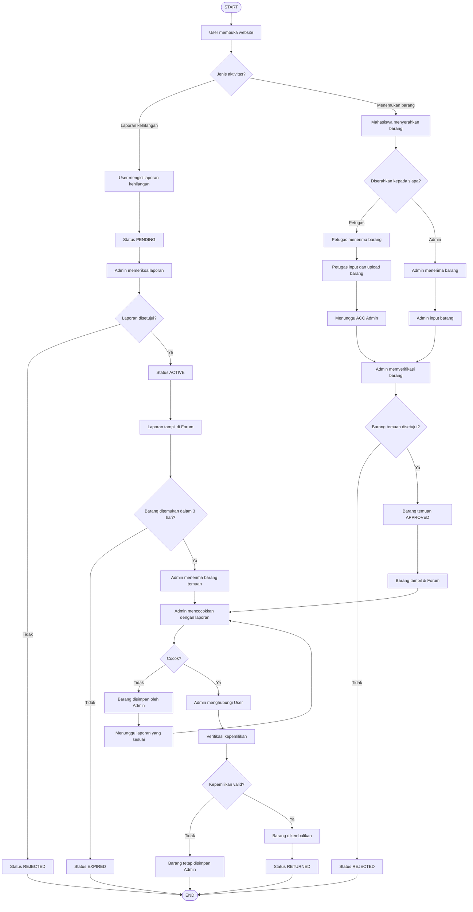

# Lost & Found Terintegrasi Kampus

> **Satu tempat resmi untuk melaporkan barang hilang, satu pintu untuk mengelola barang temuan, dan satu sistem untuk mengembalikan barang kepada pemiliknya.**

---

## 1. Ringkasan dalam 1 Menit

**Lost & Found Terintegrasi Kampus** adalah aplikasi web yang digunakan untuk mengelola barang hilang dan barang temuan di lingkungan kampus.

Mahasiswa dapat membuat laporan kehilangan melalui website. Barang temuan tidak dapat langsung diunggah oleh mahasiswa. Mahasiswa yang menemukan barang harus menyerahkannya kepada **Petugas atau Admin**. Petugas dapat mencatat dan mengunggah data barang temuan, sedangkan Admin melakukan verifikasi dan persetujuan sebelum barang ditampilkan di website.

| Pertanyaan | Jawaban |
|---|---|
| Untuk siapa? | Mahasiswa, Petugas, dan Admin |
| Apa yang dilakukan User? | Melihat informasi Lost & Found dan membuat laporan kehilangan |
| Bagaimana jika mahasiswa menemukan barang? | Barang diserahkan langsung kepada Petugas atau Admin |
| Apa peran Petugas? | Menerima barang temuan dan menginput/upload data barang |
| Apa peran Admin? | Menerima barang, memverifikasi, menyetujui laporan, mencocokkan, dan mengelola pengembalian |
| Berapa lama laporan aktif? | Maksimal 3 hari sejak disetujui |
| Kenapa lebih baik dari grup WhatsApp? | Data terpusat, terstruktur, terverifikasi, memiliki status dan riwayat |

---

# 2. Masalah dan Solusi

| Masalah di grup chat | Solusi di sistem |
|---|---|
| Informasi tertimbun chat baru | Forum terstruktur |
| Laporan lama sulit dicari | Database terpusat |
| Format informasi tidak seragam | Form laporan baku |
| Siapa saja bisa posting | Laporan harus diverifikasi Admin |
| Barang temuan bisa tidak jelas keberadaannya | Barang diserahkan ke Petugas/Admin |
| Tidak ada status yang jelas | Sistem status terstruktur |
| Tidak ada batas waktu | Laporan otomatis EXPIRED setelah 3 hari |
| Admin sulit memantau laporan | Dashboard Admin |
| Sulit mencocokkan barang hilang dan temuan | Fitur matching |
| Tidak ada bukti riwayat pengembalian | Sistem menyimpan riwayat |

---

# 3. Aturan Utama Sistem

1. Sistem memiliki **3 role**, yaitu User, Petugas, dan Admin.
2. User/Mahasiswa hanya dapat melihat informasi Lost & Found dan membuat laporan kehilangan.
3. User **tidak dapat mengupload barang temuan**.
4. Mahasiswa yang menemukan barang wajib menyerahkan barang kepada **Petugas atau Admin**.
5. Petugas dapat menerima dan menginput barang temuan ke sistem.
6. Admin dapat menerima dan menginput barang temuan secara langsung.
7. Barang temuan yang diinput Petugas harus mendapatkan **ACC Admin** sebelum dipublikasikan.
8. Laporan kehilangan User harus mendapatkan **ACC Admin** sebelum tampil di forum.
9. Laporan yang telah disetujui aktif maksimal **3 hari**.
10. Barang hanya boleh diserahkan kepada seseorang setelah Admin memverifikasi kepemilikannya.

---

# 4. Peran Pengguna

| Fitur | User | Petugas | Admin |
|---|:---:|:---:|:---:|
| Melihat halaman utama | ✅ | ✅ | ✅ |
| Melihat forum | ✅ | ✅ | ✅ |
| Mencari/filter barang | ✅ | ✅ | ✅ |
| Membuat laporan kehilangan | ✅ | ❌ | ❌ |
| Menerima barang temuan | ❌ | ✅ | ✅ |
| Input barang temuan | ❌ | ✅ | ✅ |
| Upload foto barang temuan | ❌ | ✅ | ✅ |
| Verifikasi laporan kehilangan | ❌ | ❌ | ✅ |
| ACC barang temuan | ❌ | ❌ | ✅ |
| Publikasi laporan | ❌ | ❌ | ✅ |
| Mencocokkan barang | ❌ | ❌ | ✅ |
| Menghubungi pemilik | ❌ | ❌ | ✅ |
| Verifikasi kepemilikan | ❌ | ❌ | ✅ |
| Mengelola pengembalian | ❌ | ❌ | ✅ |
| Mengelola User/Petugas | ❌ | ❌ | ✅ |
| Melihat riwayat | ❌ | ❌ | ✅ |

---

# 5. Alur Kerja Sistem


## 5.1 Alur Laporan Barang Hilang

```text
User kehilangan barang
        ↓
Login
        ↓
Membuat laporan kehilangan
        ↓
PENDING
        ↓
Admin memeriksa laporan
        ↓
     Apakah ACC?
      ↙       ↘
    Tidak      Ya
      ↓         ↓
  REJECTED    ACTIVE
                ↓
        Tampil di Forum
                ↓
       Aktif maksimal 3 hari
          ↙             ↘
   Barang ditemukan    Tidak ditemukan
          ↓                  ↓
        FOUND             EXPIRED
          ↓
 Admin mencocokkan barang
          ↓
 Verifikasi kepemilikan
          ↓
       RETURNED
```

---

## 5.2 Alur Barang Temuan

Mahasiswa **tidak dapat mengupload barang temuan secara langsung**.

```text
Mahasiswa menemukan barang
          ↓
Menyerahkan barang
          ↓
    ┌─────┴─────┐
    ↓           ↓
 Petugas      Admin
    ↓           ↓
 Input &      Input &
 Upload       Upload
    ↓           ↓
    └─────┬─────┘
          ↓
     Verifikasi Admin
          ↓
       Apakah ACC?
       ↙        ↘
    Tidak        Ya
      ↓           ↓
 Ditolak       APPROVED
                  ↓
          Tampil di Forum
                  ↓
        Mencari kecocokan
                  ↓
         Ada laporan cocok?
            ↙          ↘
          Tidak         Ya
            ↓            ↓
       Disimpan       Hubungi User
                         ↓
                 Verifikasi kepemilikan
                         ↓
                    Barang dikembalikan
                         ↓
                      RETURNED
```

---

# 6. Flowchart Utama Sistem

Flowchart berikut menggunakan simbol standar:

- **Oval** → Start/End
- **Persegi panjang** → Proses
- **Diamond** → Keputusan
- **Panah** → Arah alur



---

# 7. Contoh Skenario

### Kasus: Dompet Hitam

Rina kehilangan dompet hitam merk Eiger di Fakultas Teknik.

1. Rina membuat laporan kehilangan melalui website.
2. Status laporan menjadi `PENDING`.
3. Admin memeriksa dan menyetujui laporan.
4. Status berubah menjadi `ACTIVE`.
5. Laporan tampil di forum selama maksimal 3 hari.
6. Dimas menemukan dompet tersebut.
7. Dimas menyerahkan dompet kepada Petugas.
8. Petugas mencatat dan mengupload data dompet ke sistem.
9. Admin memeriksa dan melakukan ACC.
10. Sistem menampilkan barang temuan.
11. Admin mencocokkan barang dengan laporan Rina.
12. Data cocok.
13. Admin menghubungi Rina.
14. Rina datang ke kampus.
15. Admin memverifikasi kepemilikan.
16. Dompet dikembalikan kepada Rina.
17. Status menjadi `RETURNED`.

Jika Dimas menyerahkan barang langsung kepada Admin, Admin dapat langsung mencatat barang tersebut tanpa melalui Petugas.

---

# 8. Fitur Utama

## 8.1 Registrasi dan Login

Registrasi User membutuhkan:

| Data | Keterangan |
|---|---|
| Nama Lengkap | Nama mahasiswa |
| NIM | Nomor Induk Mahasiswa |
| Program Studi | Program studi |
| Password | Disimpan dalam bentuk hash |

NIM harus unik.

Petugas dan Admin memiliki akun dengan hak akses sesuai role.

---

## 8.2 Laporan Barang Hilang

| Field | Keterangan |
|---|---|
| Nama Barang | Nama barang |
| Kategori | Kategori barang |
| Foto | Foto barang |
| Warna | Warna barang |
| Merk | Merk barang jika ada |
| Tanggal Kehilangan | Tanggal kehilangan |
| Lokasi | Lokasi terakhir barang |
| Deskripsi | Ciri-ciri barang |

Setelah dikirim, status menjadi:

`PENDING`

---

## 8.3 Verifikasi Laporan

Admin memeriksa laporan sebelum dipublikasikan.

### Jika ditolak:

`PENDING → REJECTED`

Laporan tidak ditampilkan di forum.

### Jika disetujui:

`PENDING → ACTIVE`

Laporan ditampilkan di forum dan aktif maksimal 3 hari.

---

## 8.4 Barang Temuan

User tidak memiliki fitur upload barang temuan.

Barang temuan harus diserahkan secara langsung kepada:

- Petugas, atau
- Admin.

### Jika diterima Petugas:

```text
Petugas menerima
       ↓
Input data barang
       ↓
Upload foto
       ↓
Menunggu ACC Admin
       ↓
Admin verifikasi
```

### Jika diterima Admin:

```text
Admin menerima
       ↓
Input data barang
       ↓
Admin verifikasi
       ↓
ACC
```

---

## 8.5 Pencarian dan Filter

Forum dapat menyediakan pencarian berdasarkan:

- Nama barang
- Merk
- Deskripsi

Filter berdasarkan:

- Kategori
- Lokasi
- Tanggal
- Status

---

## 8.6 Pencocokan Barang

Admin mencocokkan barang temuan dengan laporan kehilangan berdasarkan:

- Nama barang
- Kategori
- Warna
- Merk
- Lokasi
- Tanggal
- Deskripsi
- Ciri khusus

Jika ditemukan kecocokan, Admin menghubungi User.

---

## 8.7 Verifikasi Kepemilikan

Sebelum barang dikembalikan, Admin melakukan verifikasi berdasarkan:

- Detail barang
- Ciri khusus
- Isi barang
- Bukti kepemilikan
- Informasi pada laporan kehilangan

Jika valid, barang dapat dikembalikan.

---

# 9. Masa Aktif Laporan

Laporan yang telah disetujui aktif selama **3 hari**.

```text
approved_at + 3 hari = expired_at
```

Jika tidak ditemukan kecocokan:

`ACTIVE → EXPIRED`

Laporan tidak lagi ditampilkan sebagai laporan aktif di forum, tetapi datanya tetap tersimpan sebagai riwayat.

---

# 10. Status Sistem

| Status | Arti | Terjadi Saat |
|---|---|---|
| `PENDING` | Menunggu verifikasi | User mengirim laporan |
| `REJECTED` | Ditolak | Admin menolak laporan |
| `ACTIVE` | Aktif di forum | Admin menyetujui laporan |
| `FOUND` | Barang ditemukan | Barang cocok dengan laporan |
| `RETURNED` | Barang dikembalikan | Pemilik telah diverifikasi |
| `EXPIRED` | Masa aktif berakhir | 3 hari tanpa kecocokan |

Untuk barang temuan, dapat digunakan status tambahan:

| Status | Arti |
|---|---|
| `PENDING_APPROVAL` | Menunggu ACC Admin |
| `APPROVED` | Disetujui Admin |
| `MATCHED` | Cocok dengan laporan kehilangan |
| `RETURNED` | Sudah dikembalikan |

---

# 11. Desain Database

Database utama terdiri dari enam tabel.

| Tabel | Fungsi | Kolom Utama |
|---|---|---|
| `users` | Akun User, Petugas, Admin | id, name, nim, prodi, password, role, created_at |
| `categories` | Kategori barang | id, name |
| `lost_reports` | Laporan kehilangan | id, user_id, category_id, item_name, photo, color, brand, description, lost_location, lost_date, status, approved_at, expired_at, created_at |
| `found_items` | Barang temuan | id, category_id, item_name, photo, color, brand, description, found_location, found_date, status, received_by, created_at |
| `matches` | Hubungan laporan dan barang | id, lost_report_id, found_item_id, matched_by, matched_at |
| `returns` | Riwayat pengembalian | id, lost_report_id, found_item_id, user_id, verified_by, returned_at, notes |

### Role pada tabel `users`

```text
USER
PETUGAS
ADMIN
```

Kolom `received_by` pada `found_items` digunakan untuk mencatat apakah barang diterima oleh Petugas atau Admin.

---

# 12. Halaman Aplikasi

## User

- Beranda
- Forum Lost & Found
- Cari Barang
- Buat Laporan Kehilangan
- Laporan Saya
- Detail Laporan
- Profil
- Login/Register

User tidak memiliki akses ke halaman pengelolaan barang temuan.

## Petugas

- Dashboard Petugas
- Barang Temuan
- Tambah Barang Temuan
- Upload Foto Barang
- Detail Barang
- Riwayat Barang yang Diterima

Petugas tidak dapat melakukan ACC.

## Admin

- Dashboard Admin
- Laporan Masuk
- Verifikasi Laporan
- Forum
- Barang Temuan
- Verifikasi Barang Temuan
- Pencocokan Barang
- Pengembalian Barang
- Data User
- Data Petugas
- Riwayat

---

# 13. Tech Stack

| Lapisan | Teknologi |
|---|---|
| Frontend | HTML5, CSS3, JavaScript, Bootstrap |
| Backend | Python, Flask |
| Database | MySQL / SQLite |
| Version Control | Git, GitHub |

---

# 14. MVP

### User

- [ ] Register
- [ ] Login
- [ ] Melihat forum
- [ ] Search & filter
- [ ] Membuat laporan kehilangan
- [ ] Melihat status laporan

### Petugas

- [ ] Login
- [ ] Menerima barang temuan
- [ ] Input barang temuan
- [ ] Upload foto barang
- [ ] Melihat riwayat barang yang diterima

### Admin

- [ ] Login
- [ ] Dashboard Admin
- [ ] Verifikasi laporan kehilangan
- [ ] ACC barang temuan
- [ ] Menerima barang temuan
- [ ] Input barang temuan
- [ ] Mencocokkan barang
- [ ] Menghubungi pemilik
- [ ] Verifikasi kepemilikan
- [ ] Mengelola pengembalian
- [ ] Mengelola User dan Petugas
- [ ] Melihat riwayat

---

# 15. Pengembangan Selanjutnya

Setelah MVP selesai, sistem dapat dikembangkan dengan:

- Notifikasi otomatis
- Email notification
- Peta lokasi kehilangan
- Statistik Lost & Found
- QR Code laporan
- Smart matching
- Integrasi sistem akademik kampus
- Notifikasi kepada Petugas/Admin ketika ada laporan baru

---

# 16. Pertanyaan yang Sering Muncul Saat Presentasi

### Kenapa mahasiswa tidak bisa upload barang temuan?

Agar barang temuan tidak sembarangan dipublikasikan dan keberadaannya dapat dipastikan berada di bawah pengelolaan kampus.

### Kenapa ada Petugas?

Petugas membantu menerima dan mencatat barang temuan sehingga proses pengelolaan barang tidak hanya bergantung kepada Admin.

### Apakah Admin bisa menerima barang?

Ya. Admin dapat menerima barang secara langsung dan mencatatnya ke sistem.

### Apakah barang dari Petugas langsung tampil di website?

Tidak. Barang yang diinput Petugas harus diverifikasi dan di-ACC Admin terlebih dahulu.

### Bagaimana mencegah laporan palsu?

Laporan kehilangan harus diverifikasi Admin dan User teridentifikasi menggunakan NIM.

### Bagaimana mencegah barang diberikan kepada orang yang salah?

Admin melakukan verifikasi kepemilikan sebelum barang dikembalikan.

### Apa yang terjadi setelah 3 hari?

Laporan berubah menjadi `EXPIRED` dan tidak lagi ditampilkan sebagai laporan aktif, tetapi datanya tetap tersimpan sebagai riwayat.

---

# 17. Kesimpulan

Sistem **Lost & Found Terintegrasi Kampus** membagi proses menjadi tiga pihak:

> **User melaporkan kehilangan → Petugas/Admin menerima barang temuan → Admin memverifikasi, mencocokkan, dan mengembalikan barang.**

Dengan pembagian tersebut, mahasiswa tidak dapat sembarangan mengunggah barang temuan, seluruh laporan memiliki proses verifikasi, dan pengembalian barang dilakukan melalui pihak kampus.

---

# 18. Informasi Project

| Informasi | Detail |
|---|---|
| Nama | Lost & Found Terintegrasi Kampus |
| Platform | Web-based |
| Target Pengguna | Mahasiswa dan pihak kampus |
| Role | User, Petugas, Admin |
| Status | Development |
| Backend | Flask |
| Database | MySQL / SQLite |
| Repository | GitHub |
